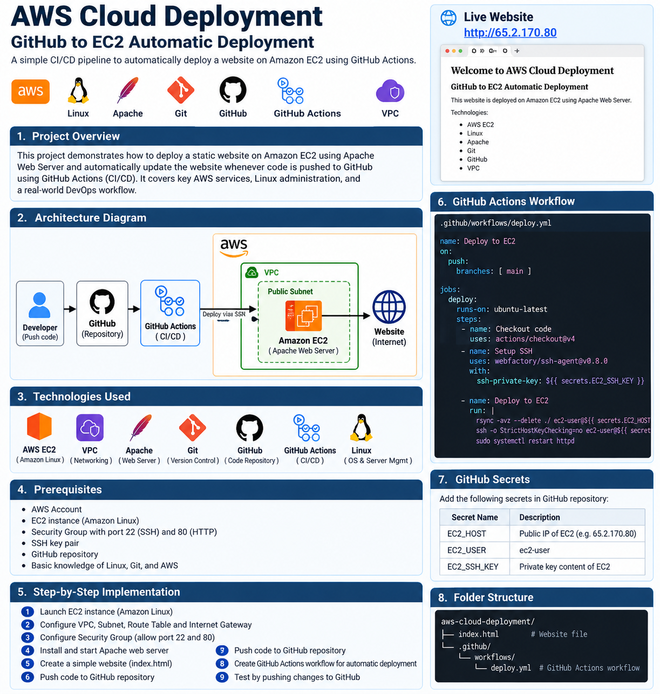
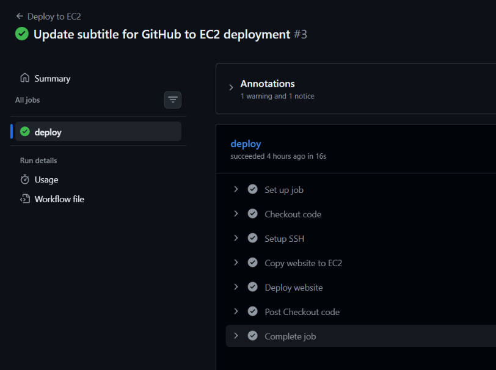

# AWS Cloud Deployment – GitHub to EC2 Automatic Deployment

A hands-on AWS cloud deployment project that demonstrates how to host a website on Amazon EC2 using Apache Web Server and automate deployment using GitHub Actions (CI/CD).

## 🚀 Project Overview

This project demonstrates a complete deployment workflow:

Developer → GitHub → GitHub Actions → SSH → Amazon EC2 → Apache Web Server → Live Website

Whenever changes are pushed to the `main` branch, GitHub Actions automatically connects to the EC2 instance, copies the updated website files, and deploys them using a deployment script.

##  Architecture

```text
Developer
    |
    | Git Push
    v
GitHub Repository
    |
    | Push to main
    v
GitHub Actions
    |
    | SSH
    v
AWS VPC
    |
    v
Public Subnet
    |
    v
Amazon EC2
    |
    | Apache HTTP Server
    v
Live Website
````


## ☁️ AWS Infrastructure

* AWS Region: Mumbai (`ap-south-1`)
* VPC: `AWS Cloud Deployment`
* VPC CIDR: `10.0.0.0/16`
* Public Subnet: `10.0.1.0/24`
* Internet Gateway
* Route Table
* Network ACL
* Security Group
* Amazon EC2
* Apache Web Server

## 🛠️ Technologies Used

* AWS EC2
* Amazon VPC
* Linux / Amazon Linux 2023
* Apache HTTP Server
* Git
* GitHub
* GitHub Actions
* SSH
* Bash Shell Scripting
* HTML

## 📁 Project Structure

```text
aws-cloud-deployment/
│
├── index.html
│
├── deploy.sh
│
└── .github/
    └── workflows/
        └── deploy.yml
```

## ⚙️ Deployment Process

### 1. AWS Infrastructure

Created the following AWS resources:

* VPC
* Public Subnet
* Internet Gateway
* Route Table
* Network ACL
* Security Group
* EC2 Instance

### 2. Apache Installation

Apache was installed and configured on Amazon Linux:

```bash
sudo dnf install httpd -y
sudo systemctl enable httpd
sudo systemctl start httpd
```

### 3. Website Deployment

The website is hosted in:

```text
/var/www/html/index.html
```

Apache serves the website on HTTP port `80`.

### 4. GitHub Repository

The source code is maintained in the GitHub repository:

```text
aws-cloud-deployment
```

### 5. GitHub Actions CI/CD

The workflow is triggered whenever code is pushed to the `main` branch.

```yaml
name: Deploy to EC2

on:
  push:
    branches:
      - main
```

The workflow:

1. Checks out the repository code.
2. Sets up SSH authentication.
3. Copies `index.html` to the EC2 instance.
4. Executes `deploy.sh`.
5. Updates the Apache website.

## 🔐 Security

GitHub Actions uses GitHub Secrets for sensitive EC2 connection information.

Secrets used:

```text
EC2_HOST
EC2_USER
EC2_SSH_KEY
```

Sensitive credentials and private keys are not stored directly in the source code.

## 🔄 CI/CD Workflow

```text
Code Change
     |
     v
Git Commit
     |
     v
GitHub Push
     |
     v
GitHub Actions Trigger
     |
     v
Checkout Code
     |
     v
Setup SSH
     |
     v
Copy Website to EC2
     |
     v
Run deploy.sh
     |
     v
Apache Serves Updated Website
```

## 🌐 Live Website

The website is hosted on an Amazon EC2 public IP.

> Note: EC2 public IPv4 addresses can change when an instance is stopped and started unless an Elastic IP is used.

## ✅ Project Status

* [x] AWS VPC configured
* [x] Public subnet configured
* [x] Internet Gateway configured
* [x] Route table configured
* [x] Security Group configured
* [x] EC2 instance launched
* [x] Apache installed
* [x] Website deployed
* [x] Git repository configured
* [x] GitHub repository configured
* [x] SSH deployment configured
* [x] GitHub Actions configured
* [x] Automatic deployment tested successfully

## 🎯 Key Learning Outcomes

Through this project, I gained hands-on experience with:

* AWS VPC networking
* EC2 instance management
* Linux administration
* Apache Web Server
* Git and GitHub
* SSH authentication
* GitHub Actions
* CI/CD automation
* Bash scripting
* Cloud deployment and troubleshooting

## 🔮 Future Improvements

* Add HTTPS using SSL/TLS
* Configure a custom domain using Route 53
* Add CloudWatch monitoring
* Use an Application Load Balancer
* Implement Infrastructure as Code using Terraform
* Add automated testing to the CI/CD pipeline

````
Add live website screenshot
## 🌐 Live Website


# Add deployment screenshots


## 🔄 GitHub Actions Deployment


